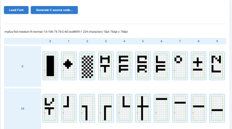

bdf-canvas
==========



This library is for parsing BDF Font and drawint it to canvas.

## BDFFont

`BDFFont` is the main class of this library. It parses a BDF (Bitmap Distribution Format) font file and provides methods to render bitmap fonts onto an HTML Canvas 2D context. You can use it to draw text, measure text size, and access font properties and glyphs.

## Demo

- [Demo]( ./demo/canvas-bdf.html )
- [Show All glyphs of BDF]( ./demo/bdf-all-glyphs.html )

## Usage

### Node.js / ESM

```js
import { BDFFont } from "bdf-canvas";

const ctx = canvas.getContext("2d");
const font = new BDFFont(bdfbody); // bdfbody: BDF file as string
font.drawText(ctx, "foobar", 10, 10);
```

### Browser

```html
<script type="module">
  import { BDFFont } from "./src/BDFFont.js"; // Adjust path as needed
  const canvas = document.getElementById("canvas");
  const ctx = canvas.getContext("2d");
  // bdfbody: BDF file as string
  const font = new BDFFont(bdfbody);
  font.drawText(ctx, "foobar", 10, 10);
</script>
<canvas id="canvas" width="300" height="100"></canvas>
```

For a more practical browser demo, see `demo/canvas-bdf.html`.
